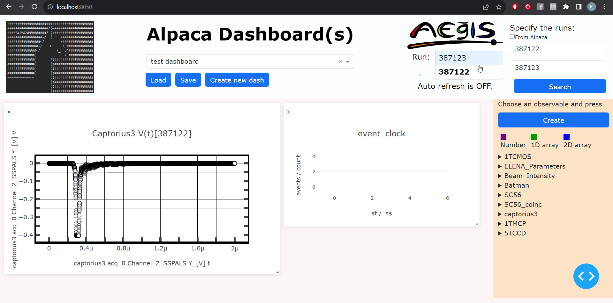

## Data apps

### Alpaca Dashboard(s)
My biggest and best documented project yet. Alpaca Dashboard(s) is an online visualisation tool built on top of a data analysis framework called [Alpaca](https://aegis.docs.cern.ch/ALPACA). ALl Python Analyses Code of Aegis (ALPACA) is a library written in Python for the Aegis experiment
at CERNs Antiproton Decelerator (AD). This tool allows users to create interactive charts and dashboards in order to observe and analyse data from experiment runs.

[View code and extensive README on Github](https://github.com/kamil5555579/alpaca-dashboard)

---

### Other smaller data apps

#### Metal Prices Visualization using Dash
Simple interactive web app that analyzes data from a CSV file, deployed using Heroku.

[View code on Github](https://github.com/kamil5555579/metals-dash)

---

#### Iris Prediction using RShiny
Interactive app that uses random forest algorithm to predict iris species, deployed using Heroku.

[View code on Github](https://github.com/kamil5555579/iris-r-heroku)

---

## Collecting data from YouTube API to AWS database
Transferring YT videos statistics to Cloud database so then they can be visualized using tools like Apache Superset.

[View code on Colab](https://colab.research.google.com/drive/1XMFMZP_2aoDi0NqYKkJDr7Er2JDQr8RO?usp=sharing)

---

## Machine learning

### Cats vs Dogs image classifier
Image classification using TensorFlow and Keras neural network.

[View code on Colab](https://colab.research.google.com/drive/1k4SbBf730U5MGPLWQzER2CgH7Lz0HBSC?usp=sharing)

---

### SMS Text Classifier
Classifing SMS messages as either normal or "spam" using TensorFlow and Keras neural network.

[View code on Colab](https://colab.research.google.com/drive/1ZeHPTX3lX_EVoo4lNJzZXbQy_1lcJMK7?usp=sharing)

---

## Java tinder-like application with an SQL database
Desktop app in Java Swing that allows user to create an account, match with other users and chat with them. All the data is saved in and loaded from an SQL database.

[View code on Github](https://github.com/kamil5555579/tinder-java)

[View presentation](/pdf/java_tinder.pdf)

---
## Related to physics

### Shrodinger equation in Python
Numerical solution of 1D, 2D and time-dependent Shrodinger equation, visualization with Plotly and Matplotlib.

[View code on Colab](https://colab.research.google.com/drive/1NwEgUGVBOi2QKI1BD8E-zYihBROB8j5k?usp=sharing)

---

### Simulation of thermal expansion
Pseudo research paper on a LAMMPS (C++ library) simulation.

[View presentation](/pdf/thermal_expansion.pdf)

---

