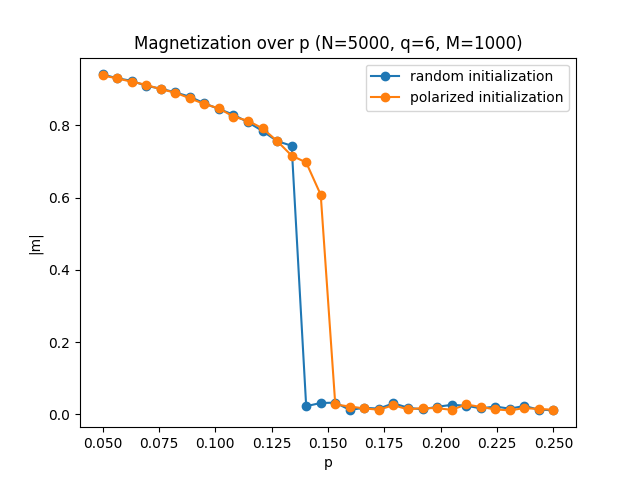
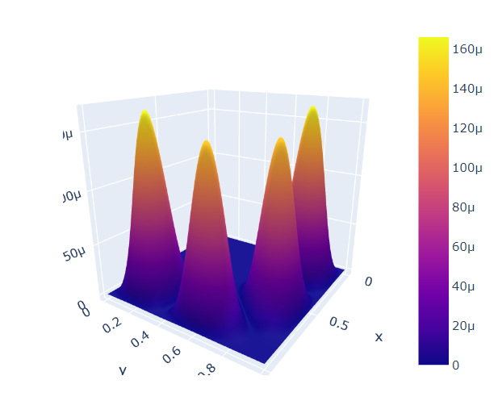

## Data apps

### Alpaca Dashboard(s)
My biggest and best documented project yet. Alpaca Dashboard(s) is an online visualisation tool built on top of a data analysis framework called [Alpaca](https://aegis.docs.cern.ch/ALPACA). ALl Python Analyses Code of Aegis (ALPACA) is a library written in Python for the Aegis experiment
at CERNs Antiproton Decelerator (AD). This tool allows users to create interactive charts and dashboards in order to observe and analyse data from experiment runs.

[View code and extensive README on Github](https://github.com/kamil5555579/alpaca-dashboard)

---

### Collecting data from YouTube API to AWS database
Transferring YT videos statistics to Cloud database so then they can be visualized using tools like Apache Superset.

[View code on Colab](https://colab.research.google.com/drive/1XMFMZP_2aoDi0NqYKkJDr7Er2JDQr8RO?usp=sharing)

---

### Java tinder-like application with an SQL database
Desktop app in Java Swing that allows user to create an account, match with other users and chat with them. All the data is saved in and loaded from an SQL database.

[View code on Github](https://github.com/kamil5555579/tinder-java)

[View presentation (in Polish)](/pdf/java_tinder.pdf)

---

## Machine learning

### Skin diseases image clusterization
Clusterization of skin images from DERMNET dataset. Extracting features with NN models and testing different visualization and clusterization methods.

[View code on Github](https://github.com/IgorKolodziej/DERMNET)

[View presentation](pdf/dermnet.pdf)

---

### Stellar classification
Classification of celestial objects that includes EDA, feature selection, model selection and explainability.

[View code on Github](https://github.com/IgorKolodziej/stellar_classification)

[View presentation](pdf/Stellar_classification.pdf)

---

### TSP
Solving travelling salesperson problem (on cities of Poland) using a Genetic Algorithm. Comparing different crossover methods, mutation rates etc.

[View code on Github](https://github.com/kamil5555579/TSP)

[View presentation](pdf/TSP.pdf)

---

### ML algorithms
Writing ML algortithms from scratch (Min-max, Multilayer perceptron, SVM, Q-learning etc.)

[View code on Github](https://github.com/kamil5555579/WSI)

---

## Battleship game
Battlehsip game in Python using a server-client architecture.

[View code on Github](https://github.com/kamil5555579/battleship)

## Related to physics

### Q-Voter model
Simulation of sociophysical model of opinion dynamics on a network/graph.

[View code on Github](https://github.com/kamil5555579/Q_Voter)

---

### Shrodinger equation in Python
Numerical solution of 1D, 2D and time-dependent Shrodinger equation, visualization with Plotly and Matplotlib.

[View code on Colab (descriptions in Polish)](https://colab.research.google.com/drive/1NwEgUGVBOi2QKI1BD8E-zYihBROB8j5k?usp=sharing)

---

